# **프로그램 만들기**  
# **C 언어의 탄생**  
C 언어는 1972년 유닉스 시스템에 사용하기 위해 캔 톰슨이 만든 B 언어를 데니스 리치가 발전시켜 만든 언어. 1969년에 개발된 초기 유닉스는 대부분 
어셈블리어로 작성되어 컴퓨터의 하드웨어가 바뀌면 유닉스를 다시 개발해야 하는 문제가 있었다. 이런 불편을 해결하고자 데니스 리치는 하드웨어에 상관없이 
사용할 수 있는 C 언어를 만들었다.  
  
# **C 언어의 장점**  
1. 시스템 프로그래밍이 가능하다. 운영체제를 개발할 목적으로 만든 언어이므로 이를 사용해 하드웨어를 제어하는 시스템 프로그래밍이 가능하다.  
2. 이식성을 갖춘 프로그램을 만들 수 있다. 이식성이란 기종이 다른 컴퓨터에서도 올바르게 작동하는 성질을 의미한다. 즉 표준을 지켜 프로그램을 만들면 
이식성을 갖추게 되어 컴퓨터의 종류가 바뀌더라도 그 프로그램을 계속해서 활용할 수 있다. 표준에 정의되지 않은 문법을 사용한 프로그램은 특정 컴파일러에서만 
컴파일될 가능성이 있어 이식성이 떨어진다.  
3. 함수를 사용해 개별 프로그래밍이 가능하다. 함수를 사용해 기능별로 프로그래밍 할 수 있으므로 개발 과정에서 에러를 수정하기 쉽고 개발된 후에도 
프로그램의 유지보수에 도움이 된다. 잘 만들어진 함수는 새로운 프로그램의 개발에 재활용할 수 있다.  
  
1999년에 제정된 C 언어의 국제 표준인 ISO/IEC 9899:1999(줄여서 C99)를 바탕으로 범용적으로 사용할 수 있는 코드를 설명한다. 따라서 표준에 따라 
구현된 컴파일러라면 그 종류와 상관없이 실습하는 데 큰 문제는 없다.  
  
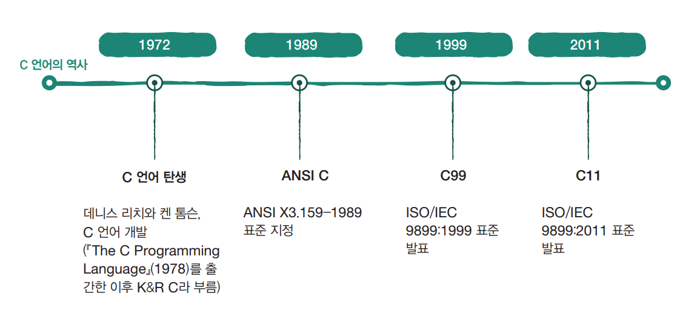  
  
# **컴파일과 컴파일러 사용법**  
프로그램을 만드는 과정을 요약하면 다음과 같다.  
  
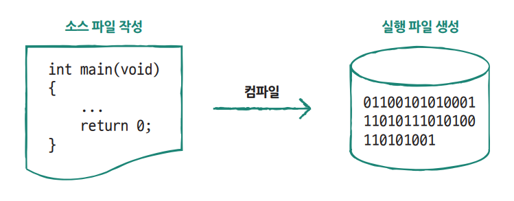  
  
컴파일: 소스 파일을 기계어로 바꾸는 과정  
Visual Studio 컴파일러로 작성  
  
# **프로젝트 생성과 소스 파일 작성**  
# **프로젝트 만들기**  
1. 비주얼 스튜디오를 실행하면 다음과 같은 화면을 볼 수 있다. 맨 아래의 [새 프로젝트 만들기] 항목을 선택한다.  
  
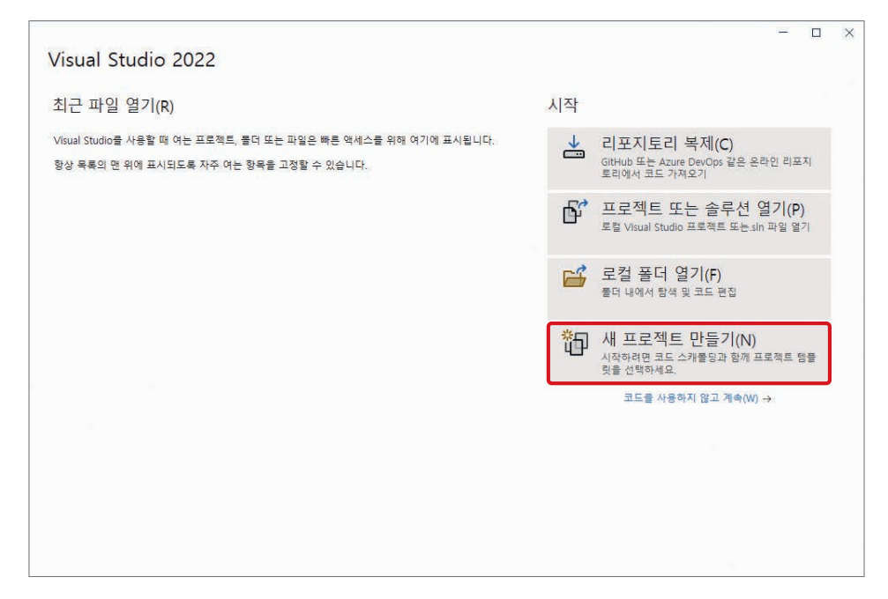  
  
2. [새 프로젝트 만들기]가 열리면 [빈 프로젝트] 항목을 선택하고 [다음] 버튼을 클릭한다. 프로젝트는 프로그램을 만들기 위한 작업 공간을 확보하고 관련 
파일을 하나로 묶어 주는 역할을 한다.  
  
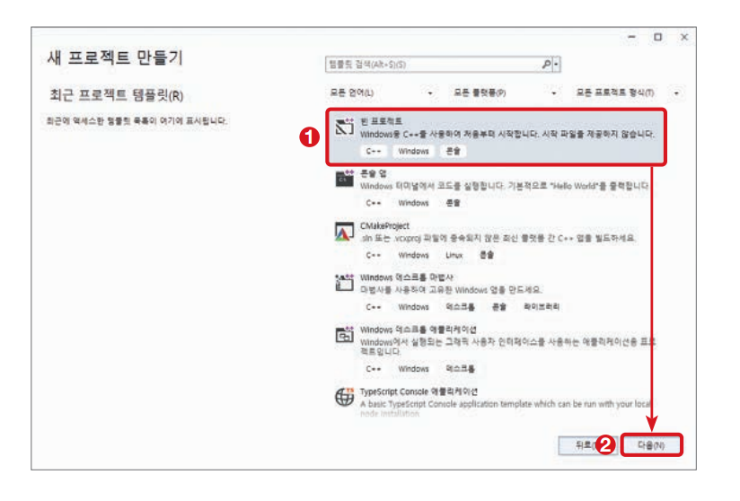  
  
3. [새 프로젝트 구성]이 열리면 [프로젝트 이름]에 first라고 입력한다. [위치]는 프로젝트가 저장되는 경로다. 그리고 [위치] 항목 바로 아래에 
[솔루션 및 프로젝트를 같은 디렉터리에 배치]를 체크한다. 이를 체크하지 않으면 프로젝트 폴더 위에 솔루션 폴더가 하나 더 만들어지므로 폴더 구조가 복잡해진다. 
설정을 모두 완료한 후에 [만들기] 버튼을 클릭한다.  
  
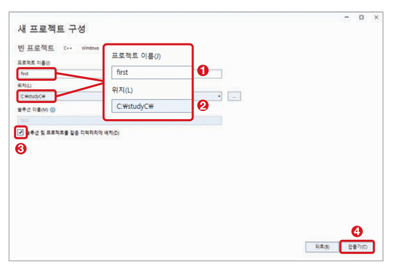  
  
4. 프로젝트 생성이 끝나면 다음과 같은 화면이 나온다. 이 화면 왼쪽 [솔루션 탐색기] 창에서 'first' 프로젝트가 생성되었음을 확인할 수 있다.  
  
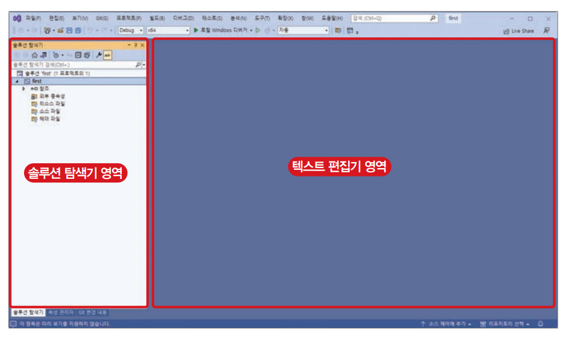  
  
# **소스 파일 만들기**  
1. [솔루션 탐색기] 창의 항목 중에 [소스 파일]을 마우스 오른쪽 버튼으로 클릭하고 [추가]-[새로운 항목]을 선택한다.  
  
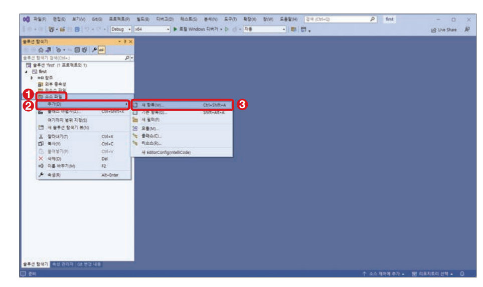  
  
2. [새 항목 추가] 대화상자에서 [Visual C++] - [C++ 파일(cpp)]을 선택한다. 그다음 [이름]에 main.c를 입력한다. 파일이 저장될 위치는 프로젝트 
폴더로 자동 설정된다. 그리고 [추가] 버튼을 클릭한다. 확장자 없이 이름을 입력하면 자동으로 cpp가 붙는데 이 경우 C++ 문법이 적용되어 실행 결과가 다를 
수 있다. 따라서 확장자 이름은 꼭 .c로 지정한다.  
  
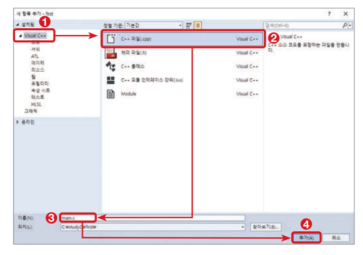  
  
3. [솔루션 탐색기] 창을 보면 소스 파일 항목에 main.c가 추가된 것을 확인할 수 있다. 또한 오른쪽에 문서를 작성할 수 있는 [텍스트 편집기]가 열린다.  
  
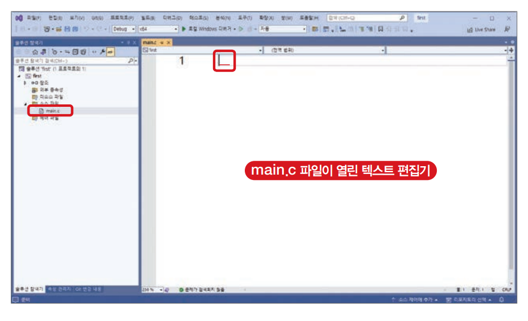  
  
4. [텍스트 편집기]에 소스 코드를 입력한다.  
first - main.c  
  
# **소스 파일 컴파일하기**  
1. 메뉴에서 [빌드]-[솔루션 빌드]를 선택해 컴파일한다. 단축키인 Ctrl + Shift + B를 눌러도 된다.  
  
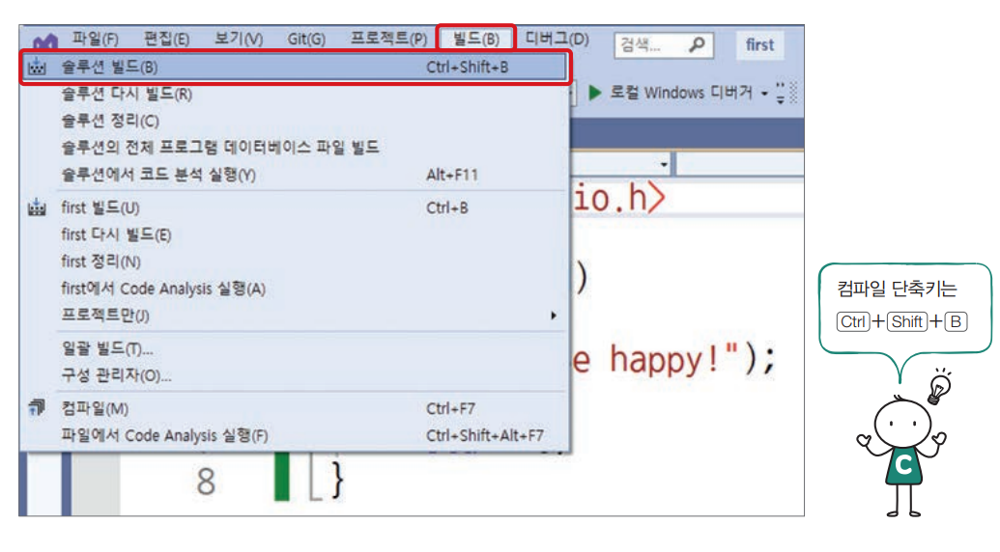  
  
2. 컴파일하면 아랫부분의 [출력] 창에서 메시지로 컴파일 결과를 알려 준다.  
  
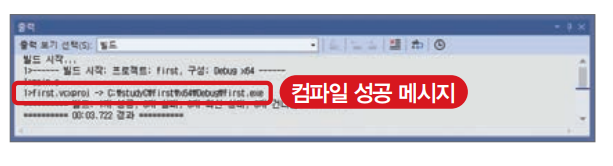  
  
3. 컴파일에 실패하면 에러 메시지를 표시한다.  
  
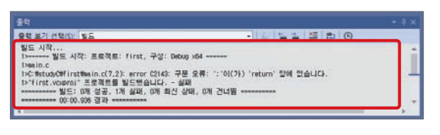  
  
4. 에러의 위치를 찾는 방법은 간단하다. 에러 메시지를 더블클릭하면 소스 코드에 문제가 있는 부분이 표시된다. 단 컴파일러가 표시하는 위치와 에러가 발생한 
곳이 정확히 일치하지 않을 수 있다.  
  
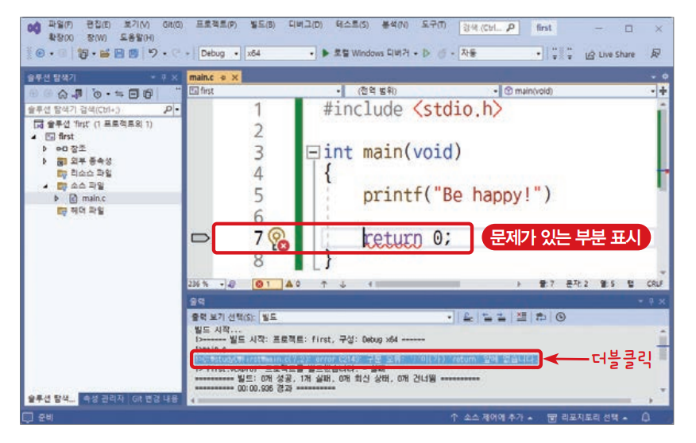  
  
[출력] 창에 있는 구문 오류라는 곳을 더블클릭하면 [텍스트 편집기]의 7행으로 커서가 이동한다. 커서는 return 0; 문장의 왼쪽에 위치하지만 실제 수정해야 
할 부분은 5행이다. 그 이유는 5행에서 printf("Be happy")의 끝에 세미콜론이 생략되어 7행까지 한 문장으로 해석하므로 7행에 에러를 표시하기 때문이다.  
  
# **실행 파일 실행하기**  
VC++ 컴파일러에서 Ctrl + F5를 누르면 프로그램을 실행해 결과를 확인할 수 있다. 결과는 Be happy!다. 이 창을 닫으려면 아무 키나 누르세요.는 
출력 창을 닫는 방법을 안내하는 메시지다. 단축키가 아닌 메뉴로 프로그램을 실행할 떄는 [디버그]-[디버그하지 않고 시작]을 선택한다.  
  
컴파일러에서 직접 실행하면 결과를 바로 확인할 수 있으며 프로그램을 수정하거나 다시 컴파일하는 작업이 편리하다. 그러나 기본적인 실행 방법은 실행 
파일을 찾아서 더블클릭하는 것이다. 소스 파일을 컴파일하면 프로젝트 폴더에 Debug 폴더가 생기는데 그 안에 프로젝트명과 같은 이름으로 실행 파일이 
저장된다. 이 파일을 더블클릭해서 실행한다.  
  
실행된 후에 결과 창이 순식간에 닫혀서 결과를 보지 못했을 것이다. 소스 코드를 수정해서 결과 창을 확인한다.  

first - main.c  
  
2행에서 사용한 #include는 지정한 파일을 추가하는 지시자다.  
7행에서 사용한 system은 시스템 명령을 수행하는 함수다. 큰따옴표 안에 시스템에서 지원하는 명령을 쓰면 그대로 실행된다. 시스템 명령은 운영체제마다 다르다.  
  
코드를 수정한 후에 Ctrl + Shift + B를 눌러 새로 컴파일하고 다시 실행 파일을 찾아 더블클릭하거나 Ctrl + F5를 누르면 컴파일러에서 실행한 것과 동일하게 
창을 띄운 상태에서 결과를 확인할 수 있다.  
  
