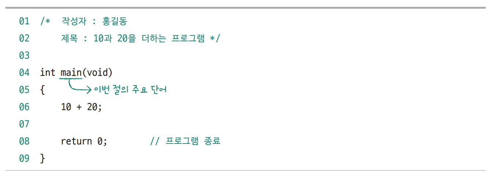
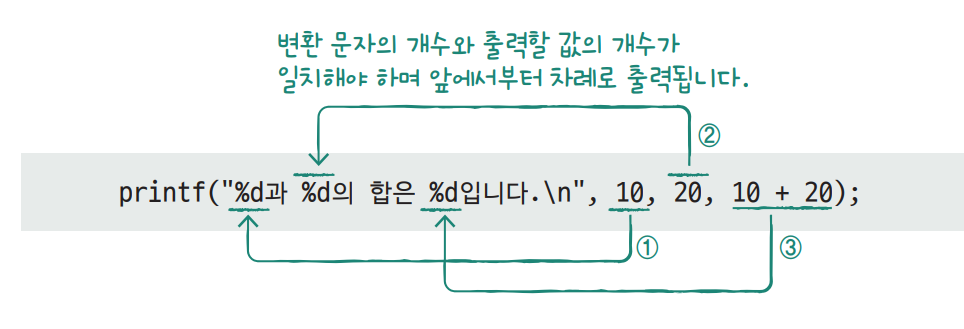
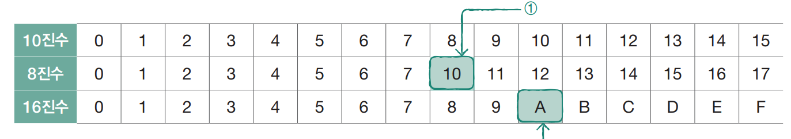
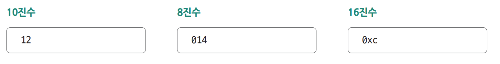
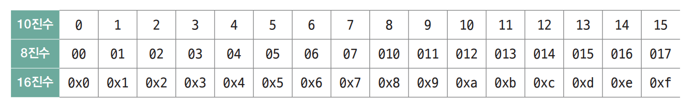
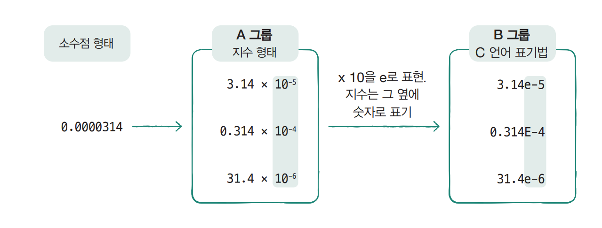
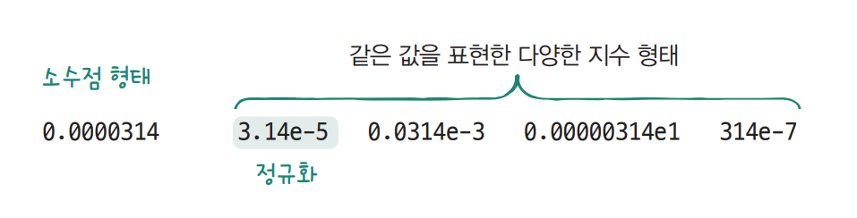
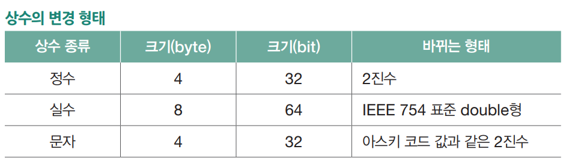

# **상수와 데이터 출력**  
# **C 프로그램의 구조와 데이터 출력 방법**  
C 프로그램은 함수로 만들어지며 함수는 일정한 기능을 수행하는 코드 단위를 의미한다. main 함수는 프로그램의 시작을 의미하며 프로그램에 반드시 있어야 한다.  
  
  
  
# **프로그램과 main 함수 구조**  
예제 코드 입력  
  
2-1 -> 2-1.c  
  
- main 함수 구조  
main 함수는 머리(head)와 몸통(body)으로 구성된다.  
머리는 함수 원형(function prototype)이라고 하며 함수의 이름과 필요한 데이터 등을 표시한다. 함수에서 실행할 일은 몸통의 중괄호 안에 작성한다. 
몸통의 마지막에는 return 0;을 넣어 프로그램을 종료한다.  
  
- 주석  
/* ~ */: 사이 주석  
//: 줄 주석  
  
- 몸통  
실행 코드 작성  
문장 끝 ; 종료, 들여쓰기, 줄 띄우기 동일  
  
# **문자열 출력: 출력 함수(printf)의 사용법**  
화면에 데이터를 출력할 떄는 printf 함수를 사용. 이 함수는 print formatted라는 뜻을 가지며 일정한 형식에 따라 출력을 수행한다.  
  
2-1 -> 2-2.c  
  
#inculde는 전처리 단계에서 처리되는 문장이다. 1행은 stdio.h 파일의 내용을 프로그램 안에 복사한다는 의미다. stdio.h는 standard input output을 
의미하며 여기에는 C 언어에서 기본으로 사용하는 입출력 함수가 들어 있다. 당연히 출력 함수인 printf 함수도 포함된다.  
  
printf 함수의 기본 기능은 문자열을 화면에 출력하는 것이다.  
  
# **제어 문자 출력**  
printf 함수로 출력할 떄 행을 바꾸려면 제어 문자를 사용해야 한다. 제어 문자란 문자는 아니지만 출력 방식에 영향을 주는 문자를 의미한다. 제어 문자를 
문자열 안에 포함시키면 그 기능에 따라 출력 형태를 바꾼다. 제어 문자는 일반 문자와 구분하기 위해 백슬래시와 함께 사용한다.  
  
2-1 -> 2-3.c  
  
- \n(개행, new line): 다음 줄로 이동  
- \b(백스페이스, backspace): 한 칸 왼쪽으로 이동  
- \r(캐리지 리턴, carriage return): 맨 앞으로 이동  
- \a(알럿 경보, alert): 벨소리  
  
# **정수와 실수 출력**  
printf 함수는 기본적으로 문자열을 출력한다. 따라서 숫자를 출력할 떄는 변환 문자를 사용해서 문자열로 변환하는 과정이 필요하다. 변환 문자는 데이터의 
형태에 따라 다르다. 정수는 %d(decimal), 실수는 %lf(long float)를 사용한다.  
  
2-1 -> 2-4.c  
  
숫자를 출력할 때는 괄호 안에 변환 문자와 숫자를 콤마로 구분해 사용하며 숫자는 변환 문자의 위치에 출력된다.  
  
printf("변환 문자", 숫자)  
  
- 소수점 자릿수 지정과 반올림  
%lf로 실수를 출력하면 소수점 이하 여섯째 자리까지 출력된다. 이때 소수점의 자릿수를 바꾸려면 %와 lf 사이에 소수점을 찍고 자릿수를 지정해야 한다.  
  
printf("%.1lf\n", 3.45); 소수점 이하 첫째 자리까지 출력  
  
잘리는 값은 반올림해서 출력된다. 첫째 자리까지 출력해야 하므로 둘째 자리부터는 반올림해서 3.5가 출력된다.  
  
- 반환 문자 여러 개 사용하기  
  
  
# **상수와 데이터 표현 방법**  
프로그램은 일의 순서를 적은 것이며 데이터는 프로그램이 처리하는 대상이다. C 언어에서 다루는 데이터에는 정수, 실수, 문자, 문자열이 있다. 그리고 데이터의 
형태로는 값을 바꿀 수 있는 변수와 바꿀 수 없는 상수 2가지가 있다.  
  
# **정수 상수 표현법**  
정수 상수는 기본적으로 아라비아 숫자 0~9, +, - 기호를 사용한다. 그리고 이를 3가지 진법, 즉 10진수, 8진수, 16진수로 표현할 수 있다.  
  
  
  
- C 언어에서 진법 표현하기  
6, 11, ...과 같은 표기로는 10진수인지 8진수인지를 구분할 수 없다. 수학에서는 밑수를 사용해서 표기하지만 프로그래밍 언어에서는 밑수를 표기할 수 
없다. 따라서 8진수는 숫자 옆에 0, 16진수는 0x를 붙여 구분한다. 그러므로 다음 3개의 값은 진법에 따라 다르게 표현한 것을 뿐 모두 같은 값이다.  
  
  
  
2-1 -> 2-5.c  
  
출력 결과를 보면 알 수 있듯이 코드 안에서 진법에 따른 수의 표현법은 다르지만 값은 같으므로 결과가 모두 같다는 걸 알 수 있다. 이렇듯 하나의 정수는 
모두 3가지 진법(10진수, 8진수, 16진수)으로 표현할 수 있다.  
  
위의 표를 C 언어에서의 표기법으로 나타내면 다음과 같다.  
  
  
  
10 진수를 8진수나 16진수로 출력할 수도 있다. 8진수로 출력하려면 %o, 16진수 소문자로 출력하려면 %x를, 대문자로 출력하려면 %X를 사용하면 된다.  
  
# **실수 상수 표현법**  
실수는 소수점 형태와 지수 형태로 표현할 수 있다. 소수점 형태로 표현할 떄 실수는 아라비아 숫자 0~9, +, - 기호와 소수점을 사용한다. 예를 들어 다음과 
같이 표현한다.  
  
- 3.4, -1.5, +10.0, .5, -10. (소수점 앞이나 뒤의 무의미한 0은 생략할 수 있다)  
  
그런데 이공계열에서 다루는 크고 작은 숫자는 지수 형태(지수 표기법)로 표기한다. 0.0000314를 지수 형태로 바꿔본다.  
  
  
  
A 그룹은 소수점 형태를 지수 표기법으로 바꾼 것이다. B 그룹은 A 그룹의 지수 표기법을 C언어의 표현 형식으로 바꾼 것이다. e는 밑수 10을 의미하며 
대문자로 쓸 수도 있다. 즉 3.14e-5나 3.14E-5는 같은 의미다. 소수점 부분에서 무의미한 0이나 소수점은 생략할 수 있다.  
  
지수 형태를 지수 값의 크기에 따라 무수히 많은 방법으로 표현할 수 있다. 그중 소수점 앞에 0이 아닌 유효 숫자 한 자리를 사용해 지수 형태로 바꾼 것을 
정규화(normalization) 표기법이라고 한다.  
  
  
  
printf 함수가 실수를 지수 형태로 출력할 떄는 기본적으로 정규화 표기법을 사용한다.  
  
2-1 -> 2-6.c  
  
실행결과에서 알 수 있듯이 출력 값을 지수 형태로 사용해도 printf 함수는 기본적으로 소수점 형태로 출력한다. 지수 형태로 출력하려면 %le 변환 문자를 
사용한다.  
  
1e6은 실수형 상수 1000000.0을 지수 형태로 표현한 것이다.  
3.14e-5는 소수점 형태로 0.0000314다.  
  
%lf 변환 문자로 실수를 출력하면 소수점 이하 여섯째 자리까지만 출력되는데 여기는 총 7자리다. 기본 출력 방식을 따르면 소수점 이하 여섯째 자리까지만 
출력되어 0.000031이 출력되니 %.7lf를 사용해 소수점 이하 일곱째 자리까지 출력하도록 했다. 이렇게 출력할 숫자가 많을 떄는 소수점 이하 자릿수를 충분히 
잡아서 유효 숫자가 잘리지 않도록 해야한다.  
  
%le 변환 문자는 소수점 형태의 실수를 지수 형태로 출력한다. 이때는 항상 정규화 표현법으로 출력하며 소수점 이하 자릿수를 지정하려면 %와 le 사이에 점을 
찍고 원하는 숫자를 사용한다.  
  
printf("%.2le\n", 0.0000314);  
  
# **문자와 문자열 상수 표현법**  
문자는 작은따옴표로 묶고 문자열은 큰따옴표로 묶는다.  
  
2-1 -> 2-7.c  
  
문자와 문자열을 출력할 때도 변환 문자를 사용한다. 문자는 %c 변환 문자를, 문자열은 변환 문자 없이도 바로 출력할 수 있으나 보통 %s를 사용한다.  
  
# **상수가 컴파일된 후의 비트 형태**  
편집기에 코드를 입력하면 이 코드는 모두 컴퓨터가 이해하는 형태의 아스키 코드 값으로 저장된다.  
  
예를 들어 10 + 20;을 입력했다면 1, 0, +, 2, 0, ;이 모두 하나의 문자로 저장된다. 이것이 컴파일 과정이 없으면 코드가 컴퓨터에서 실행되지 않는 
이유다. 컴퓨터에서는 +는 덧셈을 하나는 명령이 아니라 그저 + 문자이며 10과 20도 연산이 가능한 값이 아니라 그냥 문자다.  
  
  
  
