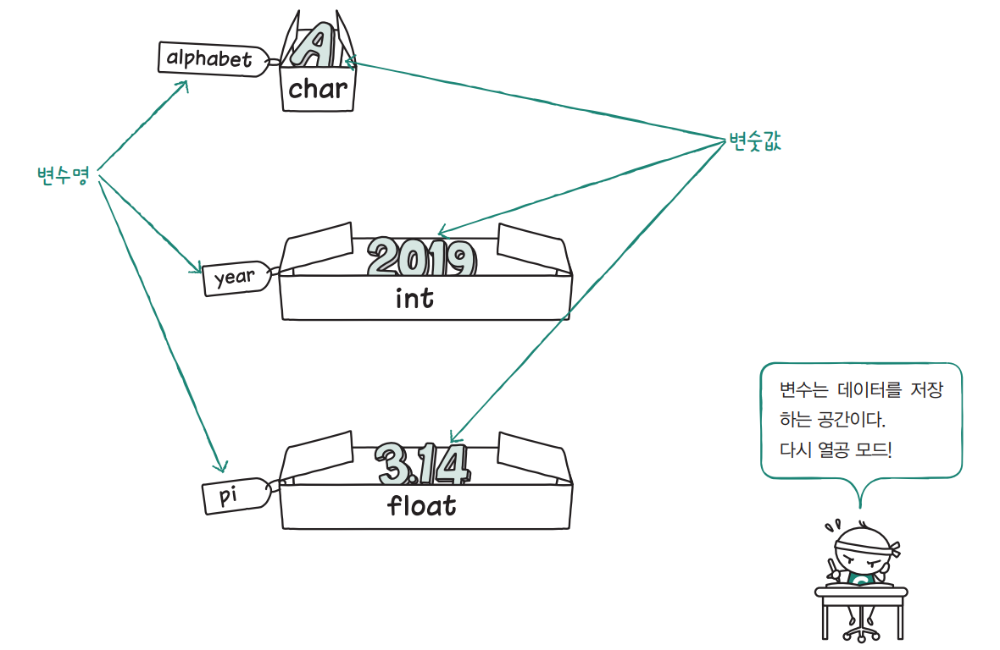

# **변수와 데이터 입력**  
# **변수**  
프로그램에서 데이터를 메모리에 저장해 놓으면 필요할 때마다 꺼내 사용할 수 있다. 이떄 변수 선언을 통해 메모리에 저장 공간을 확보한다. 변수는 데이터의 
종류에 따라 각각 다른 형태를 사용하는데 정수는 int, 실수는 double, 문자는 char, 문자열은 char 배열을 사용한다.  
  
  
  
