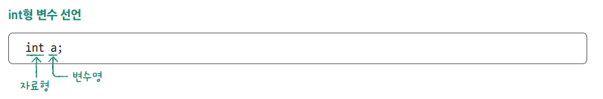
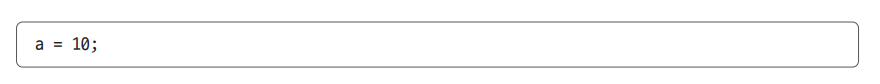
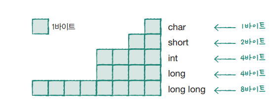
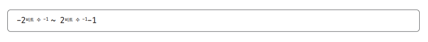
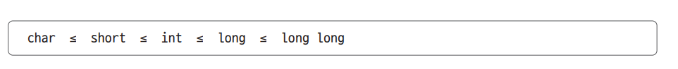
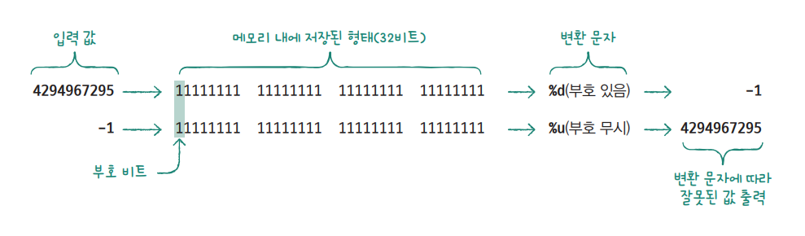

# **변수와 데이터 입력**  
# **변수**  
프로그램에서 데이터를 메모리에 저장해 놓으면 필요할 때마다 꺼내 사용할 수 있다. 이떄 변수 선언을 통해 메모리에 저장 공간을 확보한다. 변수는 데이터의 
종류에 따라 각각 다른 형태를 사용하는데 정수는 int, 실수는 double, 문자는 char, 문자열은 char 배열을 사용한다.  
  
  
  
# **변수 선언 방법**  
  
  
프로그램이 종료되면 선언된 값은 의미가 없으므로 이를 쓰레기값(garbage value)이라고 한다. 이 쓰레기 값 때문에 프로그램에 오류가 생길 수 있으므로 반드시 
원하는 값으로 바꾸는 초기화 과정이 필요하다.  
  
  
  
3-1 -> 3-1.c  
  
a = 10;  
b = a;  
  
위와 같이 변수의 용도가 다름을 설명하기 위해 저장 공간으로 사용하는 변수를 l-value(left value), 값으로 사용하는 변수를 r-value(right value)
로 구분하기도 한다.  
  
# **정수 자료형**  
크게 정수형과 실수형으로 구분  
  
  
  
크기가 큰 자료형이 더 많은 범위와 값을 저장할 수 있고 그 범위는 다음 공식에 따라 계산된다.  
  
  
  
char형은 작은 범위의 정수를 저장할 수 있지만 주로 문자를 저장하는 용도로 쓰인다.  
  
컴파일러는 프로그램에서 사용하는 모든 문자를 0~127 사이의 정수(아스키 코드 값)로 바꾸어 처리하므로 char형 변수를 사용하면 문자를 효가적으로 
저장할 수 있다.  
  
3-1 -> 3-2.c  
  
정수형에는 char 외에도 많은 자료형이 있으므로 처리할 데이터의 크기에 따라 적절한 자료형을 선택해 사용하면 된다.  
  
3-1 -> 3-3.c  
  
각 자료형은 저장 값의 범위가 다르지만 출력할 떄는 모두 %d를 사용한다. 단 long 형은 소문자 l을 붙여 %ld로 출력하고 long long 형은 2개를 붙여 
%lld로 출력한다.  
  
어떤 자료형을 사용할지 고민된다면 다음 방법을 따르면 된다.  
  
1. 특별한 경우가 아니면 정수형을 표현할 떄는 int를 사용한다.  
int 형은 연산의 기본 단위로 컴퓨터에서 가장 빠르게 연산된다. short형은 int형보다 크기가 작아 메모리를 작게 사용하지만 연산 과정에서 int형으로 
변환되므로 실행 속도가 느려질 수 있다. long long형은 크기가 8바이트이므로 int형으로 저장할 수 없는 큰 범위의 값을 저장할 수 있지만 메모리의 낭비가 
크다. 각 자료형의 크기는 컴파일러나 버전에 따라 다를 수 있으나 다음 기준에 따라 구현된다.  
  
  
  
2. long 형은 큰 값을 저장할 때 사용한다.  
보통 컴파일러에서 int형은 4바이트다. 그런데 int형이 2바이트로 구현된 컴파일러가 간혹 있다. 이때 큰 값을 저장하기 위해 long 형을 사용한다. int형과 
long형의 크기를 동일하게 인식하는 컴파일러를 사용한다면 long형을 쓸 필요가 없다.  
  
현재 사용하는 컴파일러에서 구현된 자료형의 크기가 궁금하면 sizeof 연산자로 확인할 수 있다.  
  
# **unsigned 정수 자료형**  
정수형은 보통 양수와 음수를 모두 저장하지만 양수만 저장하면 두 배 더 넓은 범위의 값을 저장할 수 있다. 따라서 나이와 같이 음수가 없는 데이터를 
저장할 떄는 unsigned를 사용한다. unsigned가 없으면 자동으로 signed로 선언된다. 자료형에 unsigned만 붙이면 된다.  
  
unsigned 자료형을 사용할 떄는 출력 시 변환 문자 사용에 주의해야 한다. unsigned 변수에 큰 양수를 저장하고 %d로 출력하면 음수가 출력될 가능성이 
있으며 음수를 저장하고 %u로 출력하면 양수가 출력된다.  
  
3-1 -> 3-4.c  
  
실행결과를 보면 저장한 값과 반대다. 그 이유는 두 정수가 메모리에 저장되는 형태는 같으나 printf 함수가 데이터를 해석해서 보여주는 방법이 다르기 때문이다. 
먼저 %d는 부호까지 생각해서 10진수로 출력하는 변환 문자고 %u는 부호 없는 10진수로 출력하는 변환 문자다.  
  
  
  
결국 unsigned형 변수에 음수도 저장하고 출력할 수 있다. 그러나 연산하거나 대소를 비교할 때는 부호 비트를 고려하지 않고 항상 양수로 처리하므로 결과가 
예상과 다를 수 있다. 따라서 unsigned 자료형을 사용할 떄는 항상 양수만 저장하고 %u로 출력한다.  
  
