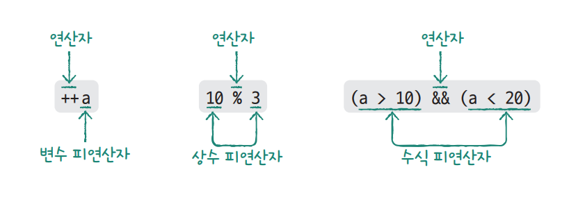
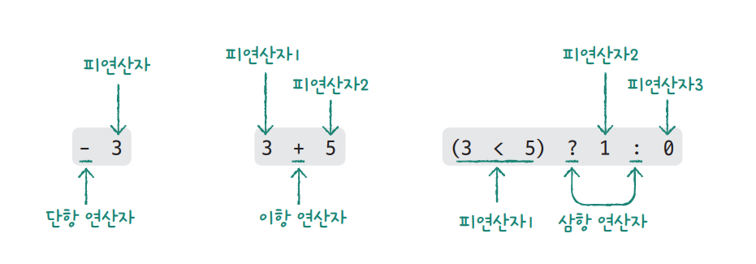
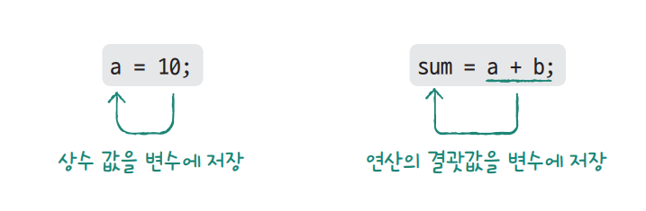

# **연산자**  
# **산술 연산자, 관계 연산자, 논리 연산자**  
기본적인 내용으로 이미지로 대체  
  
  
  
  
# **산술 연산자와 대입 연산자**  
- 산술 연산자  
예제로 대체  
  
4-1 -> 4-1.c  
  
- 대입 연산자  
  
  
- 나누기 연산자와 나머지 연산자  
예제로 대체  
  
4-1 -> 4-2.c  
  
