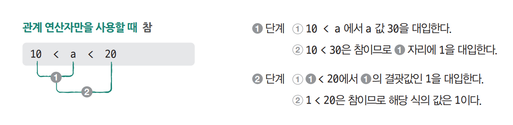

# **연산자**  
# **산술 연산자, 관계 연산자, 논리 연산자**  
기본적인 내용으로 이미지로 대체  
  
  
  
  
# **산술 연산자와 대입 연산자**  
- 산술 연산자  
예제로 대체  
  
4-1 -> 4-1.c  
  
- 대입 연산자  
  
  
- 나누기 연산자와 나머지 연산자  
예제로 대체  
  
4-1 -> 4-2.c  
  
# **증감 연산자**  
예제로 대체  
  
4-1 -> 4-3.c  
  
# **전위 표기와 후위 표기**  
예제로 대체  
  
4-1 -> 4-4.c  
  
# **관계 연산자**  
참 = 1, 거짓 = 0  
예제로 대체  
  
4-1 -> 4-5.c  
  
# **논리 연산자**  
예제로 대체  
  
4-1 -> 4-6.c  
  
  
  
# **숏 서킷 룰**  
&&는 좌항이 거짓이면 우항 연산을 안함  
||는 좌항이 참이면 우항 연산을 안함  
불필요한 연산을 줄여 실행 속도를 높임  
  
# **연산의 결괏값을 처리하는 방법**  
예제로 대체  
  
4-1 -> 4-7.c  
  