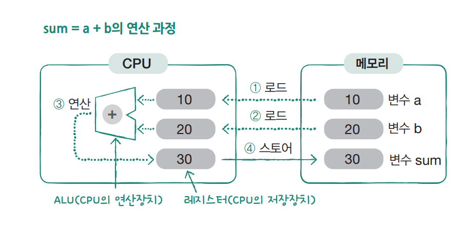

# **연산자**  
# **산술 연산자, 관계 연산자, 논리 연산자**  
기본적인 내용으로 이미지로 대체  
  
  
  
  
# **산술 연산자와 대입 연산자**  
- 산술 연산자  
예제로 대체  
  
4-1 -> 4-1.c  
  
- 대입 연산자  
  
  
- 나누기 연산자와 나머지 연산자  
예제로 대체  
  
4-1 -> 4-2.c  
  
# **증감 연산자**  
예제로 대체  
  
4-1 -> 4-3.c  
  
# **전위 표기와 후위 표기**  
예제로 대체  
  
4-1 -> 4-4.c  
  
# **관계 연산자**  
참 = 1, 거짓 = 0  
예제로 대체  
  
4-1 -> 4-5.c  
  
# **논리 연산자**  
예제로 대체  
  
4-1 -> 4-6.c  
  
  
  
# **숏 서킷 룰**  
&&는 좌항이 거짓이면 우항 연산을 안함  
||는 좌항이 참이면 우항 연산을 안함  
불필요한 연산을 줄여 실행 속도를 높임  
  
# **연산의 결괏값을 처리하는 방법**  
예제로 대체  
  
4-1 -> 4-7.c  
  
# **연산식이 컴퓨터 내부에서 처리되는 방식**  
수식 sum = a + b의 연산 과정을 나타내는 그림  
  
  
  
연산을 하려면 메모리에 있는 a와 b의 값을 CPU의 저장 공간인 레지스터에 복사해야 한다. 이 과정을 로드(load)라고 하며 연산 명령 이전에 먼저 수행된다. 
데이터가 레지스터에 저장되면 연산장치인 ALU에 의해 덧셈 연산이 수행되고 그 결괏값은 일단 레지스터에 저장된다. 이후 대입 연산을 수행하면 메모리 공간인 
sum에 복사되어 수식의 모든 과정이 완료된다. 이 과정을 스토어(store)라고 한다. 연산할 때는 메모리에 있는 변수의 값을 CPU로 복사해서 사용하므로 
아무리 많은 연산을 수행해도 피연산자 a, b의 값은 변하지 않는다. 반면 대입 연산을 수행한 sum은 연산장치인 ALU에서 어떤 연산이 수행되느냐에 따라 값이 
변할 수 있다.  
  
